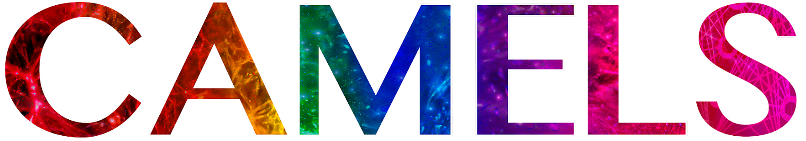
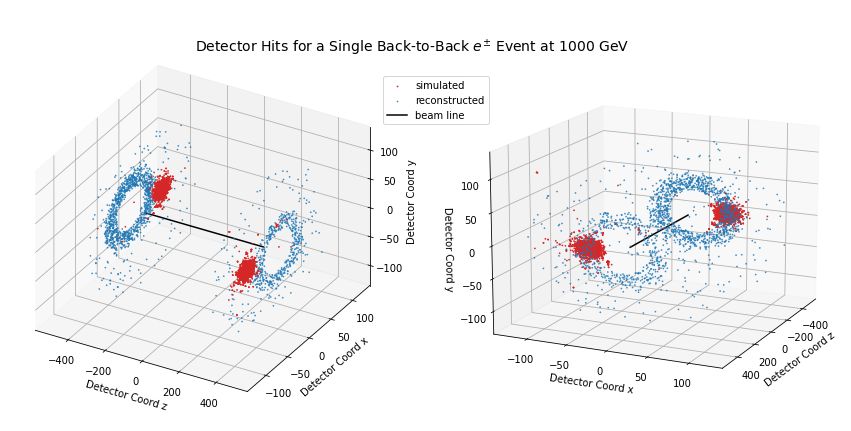

My research is primarily in computational (astro)physics. That is, I use and help build simulations designed to run on some of the world's biggest supercomputers. I'm also interested in using the large data sets produced by these simulations in machine learning applications. Below are some of my current and past works.   

----
### Galaxy Formation and Cosmology
I am currently working with Shy Genel designing new sub-grid models for cosmological (magneto)hydrodynamic simulations on which to base a new simulation suite for the Cosmology and Astrophysics with MachinE Learning Simulations ([CAMELS](https://camels.readthedocs.io/en/latest/)) project.

  

One of my ongoing projects is to study structural formation in the early universe -- particularly, star clusters -- by running zoom-in radiation hydrodynamics simulations. The movie below (more movies can be found [here](https://www.youtube.com/@fredangelogarcia)) shows the formation of the first star clusters in a low mass dwarf galaxy at high redshifts for different assumed star formation efficiencies (SFE). For more details, see [2023MNRAS.522.2495G](https://ui.adsabs.harvard.edu/abs/2023MNRAS.522.2495G/abstract).

<video width="615" loop="loop" muted="muted" plays-inline="true" autoplay>
  <source type="video/mp4" src="https://terpconnect.umd.edu/~fgarcia4/cosmology/halo_D/two_panel_sfr_rev1.mp4">
</video>

----
### Astroparticle Physics

  

$\nu$SpaceSim is an end-to-end Python simulation package designed to aid cosmic $\nu_\tau$ detection via atmospheric interactions. The software simulates all aspects of neutrino detection, from propagation to signal detection. It does this by sampling monte-carlo simulation libraries. Currently, I'm helping build the extensive air shower module. Checkout the [latest build](https://github.com/NuSpaceSim/nuSpaceSim).

----
### High Energy Physics

  

I was previously a part of a high energy physics group, helping assesses the performance of the endcap calorimeters of the CMS experiment at the LHC through simulations. The plot above shows the simulated and reconstructed hits from a particle gun for this specific detector component, the HGCAL. Knowing how well a certain detector geometry version can resolve energies at the TeV regime can help assess its future performance. 
 
----
